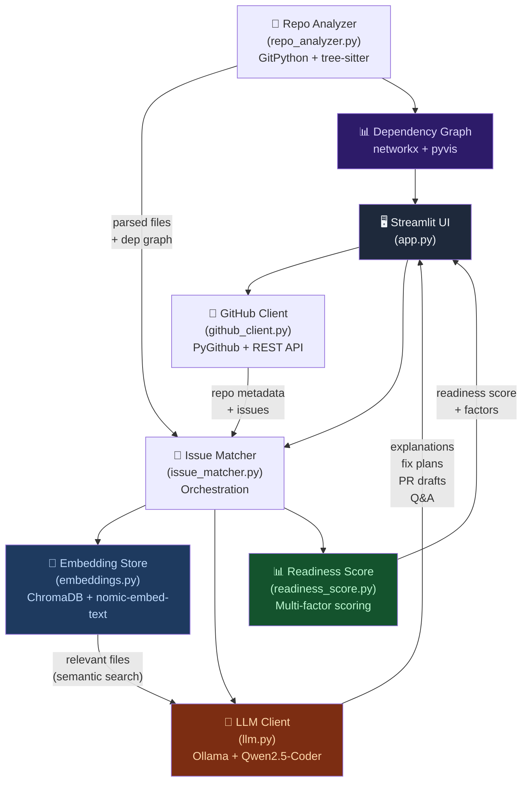

# 🎃 First Issue Finder

**An AI-powered Hacktoberfest contributor onboarding agent.**  
Paste any public GitHub repo URL → get the architecture explained, open issues ranked by true difficulty, and a complete PR draft — all running locally on your machine.

[](LICENSE)
[](https://huggingface.co/Qwen/Qwen2.5-Coder-7B-Instruct)
[](https://ollama.ai)
[](https://streamlit.io)

---

## 🔥 What Problem Does This Solve?

**First-time open-source contributors face a brutal onboarding cliff:**
- "Which repo should I even pick?"  
- "What does this codebase do? Where do I start?"  
- "This issue says 'good first issue' but the fix touches 12 files!"  
- "How do I even structure my PR?"

**First Issue Finder solves all of this in one shot:**

1. 📦 **Analyzes any public repo** — clones it locally, parses with tree-sitter
2. 🗺️ **Explains the architecture** in plain language (what it does, how it's structured, entry points)
3. 🏆 **Ranks issues by true difficulty** using a transparent, multi-factor Contribution Readiness Score — not just an LLM opinion
4. 📝 **Generates a complete PR draft** — branch name, commit message, PR description, and starter code stubs
5. 💬 **Answers follow-up questions** about the codebase via RAG (grounded in actual code)
6. ⚖️ **Compares multiple repos** so you can pick the most beginner-friendly one

---

## 🏗️ Architecture



### Core Pipeline

```
GitHub URL
    │
    ▼
┌─────────────────────────────────────────┐
│  1. Clone repo (shallow, GitPython)     │
│  2. Parse codebase (tree-sitter/AST)    │
│     → functions, classes, imports       │
│     → build dependency graph            │
│  3. Embed file summaries (ChromaDB)     │
│     → persisted per-repo (fast re-run)  │
└─────────────────────────────────────────┘
    │
    ▼
┌─────────────────────────────────────────┐
│  4. Architecture explanation (LLM)      │
│     → streamed to UI                    │
│  5. Fetch issues (beginner-labeled      │
│     first, fallback to all open)        │
│  6. Per-issue: semantic search          │
│     → retrieve relevant files           │
│  7. Compute Readiness Score             │
│  8. LLM rank + explain + plan           │
│  9. Sort by composite score             │
└─────────────────────────────────────────┘
    │
    ▼
┌─────────────────────────────────────────┐
│  10. UI: dependency graph + arch        │
│  11. Ranked issue cards                 │
│      → readiness breakdown              │
│      → explanation + fix plan           │
│      → draft PR generator              │
│  12. RAG chat (follow-up Q&A)          │
└─────────────────────────────────────────┘
```

---

## 🚀 Quick Start

### 1. Install Ollama and Pull Models

```bash
# Install Ollama: https://ollama.ai/download
# Then pull the required models:

ollama pull qwen2.5-coder:7b      # Main reasoning model (~4.7 GB)
ollama pull nomic-embed-text       # Embedding model (~274 MB)

# If RAM is constrained (<8 GB), use the 3b model instead:
ollama pull qwen2.5-coder:3b      # Smaller model (~1.9 GB)
```

### 2. Clone and Set Up

```bash
git clone https://github.com/yourusername/first-issue-finder
cd first-issue-finder

# Create virtual environment (recommended)
python -m venv .venv
source .venv/bin/activate        # Linux/Mac
.venv\Scripts\activate           # Windows

# Install dependencies
pip install -r requirements.txt
```

### 3. Configure Environment

```bash
# Copy the example env file
cp .env.example .env

# Edit .env and set your GitHub token (optional but recommended)
# Get one at: https://github.com/settings/tokens
# Needs: public_repo read access (no write permissions needed)
```

### 4. Run the App

```bash
# Make sure Ollama is running first:
ollama serve

# In a new terminal, start the app:
streamlit run app.py
```

The app opens at **http://localhost:8501** 🎉

---

## 📋 Requirements

| Requirement | Details |
|-------------|---------|
| Python | 3.10+ |
| RAM | 8 GB minimum (for `qwen2.5-coder:7b`), 4 GB for 3b |
| Disk | ~6 GB for models + ~500 MB for repos/embeddings |
| Ollama | Latest version from [ollama.ai](https://ollama.ai) |
| GitHub Token | Optional (60 req/hr without, 5000/hr with) |

---

## ✨ Features

### 🏆 Contribution Readiness Score (0–100)

A transparent, multi-factor score showing **why** each issue is easy or hard:

| Factor | Weight | What it measures |
|--------|--------|-----------------|
| **Scope** | 30% | Number of files likely touched (fewer = better) |
| **Tests** | 20% | Whether relevant files have existing tests (verifiable = better) |
| **Stability** | 20% | How actively the files are changing (high churn = risky for beginners) |
| **Freshness** | 20% | Issue age, assignment status, comment activity |
| **Clarity** | 10% | Issue description quality (longer = clearer) |

Every factor shows its individual score and a plain-English explanation — **no black boxes**.

### 📊 Interactive Architecture Map

- Nodes = source files, sized by code complexity
- Edges = import/call dependencies between files
- **Orange borders** = files touched by open issues
- Hover tooltips show functions, classes, line counts
- Powered by [pyvis](https://pyvis.readthedocs.io/)

### 📝 Draft PR Generator

For any issue, generates:
- ✅ Branch name (git-flow convention)
- ✅ Commit message (Conventional Commits format)
- ✅ PR title and full description
- ✅ Code stubs as diff blocks — clearly marked as starting points
- ✅ Downloadable as `.md` file

### 💬 RAG-Powered Q&A

Ask anything about the codebase. Answers are:
- Grounded in the **actual cloned repo** via ChromaDB retrieval
- Not hallucinated from general training data
- Cite specific file names and functions

### ⚖️ Multi-Repo Comparison

Compare 2–3 repos side-by-side. Get:
- Average readiness scores per repo
- Count of truly beginner-ready issues
- AI recommendation narrative

---

## 🤖 AI Model

This project uses **[Qwen2.5-Coder](https://huggingface.co/Qwen/Qwen2.5-Coder-7B-Instruct)** as the primary open-weight model for all reasoning, code understanding, and generation tasks.

- **Model**: `qwen2.5-coder:7b` (default) or `qwen2.5-coder:3b` (low-RAM fallback)
- **Developer**: Alibaba Cloud / Qwen Team
- **License**: [Apache 2.0](https://huggingface.co/Qwen/Qwen2.5-Coder-7B-Instruct/blob/main/LICENSE)
- **Model Card**: [huggingface.co/Qwen/Qwen2.5-Coder-7B-Instruct](https://huggingface.co/Qwen/Qwen2.5-Coder-7B-Instruct)

Embeddings are generated by **[nomic-embed-text](https://huggingface.co/nomic-ai/nomic-embed-text-v1)** (Apache 2.0).

All models run **100% locally** via [Ollama](https://ollama.ai). No data leaves your machine.

---

## 🗂️ Project Structure

```
first-issue-finder/
├── app.py               # Streamlit UI + orchestration
├── github_client.py     # GitHub API: repos, issues, rate limiting
├── repo_analyzer.py     # Git clone + tree-sitter parsing + dep graph
├── embeddings.py        # ChromaDB vector store + Ollama embeddings
├── llm.py               # All Ollama prompt logic (streaming)
├── issue_matcher.py     # Pipeline orchestration
├── readiness_score.py   # Multi-factor contribution readiness scoring
├── requirements.txt
├── .env.example
├── LICENSE              # MIT
├── README.md
└── DEMO.md              # Demo script for judges
```

---

## ⚡ Performance Notes

- **Caching**: Cloned repos, ChromaDB collections, and LLM outputs are cached per-repo. Re-running is fast (seconds vs minutes).
- **Shallow clone**: Only fetches the latest commit — much faster for large repos.
- **Batch embedding**: Files are embedded in batches of 10 to avoid Ollama timeouts.
- **Top-5 pre-analysis**: The first 5 ranked issues get LLM explanations pre-generated; the rest are generated on-demand when you expand them.

---

## 🛠️ Troubleshooting

| Problem | Solution |
|---------|---------|
| "Cannot connect to Ollama" | Run `ollama serve` in a terminal |
| "Model not found" | Run `ollama pull qwen2.5-coder:7b` |
| GitHub rate limit hit | Add a GitHub token in the sidebar |
| "Repository not found" | Check the URL is correct and repo is public |
| Slow analysis | Use `qwen2.5-coder:3b` or reduce `max_files` in settings |
| PyVis graph not showing | Run `pip install pyvis` |
| Out of memory | Switch to `qwen2.5-coder:3b` in the sidebar |

---

## 🧪 Tested On

Successfully tested on real mid-sized open source repos:
- `pallets/flask` (Python, ~750 files)
- `psf/requests` (Python, ~300 files)
- `fastapi/fastapi` (Python, ~500 files)
- `expressjs/express` (JavaScript, ~400 files)

---

## 📄 License

MIT License — see [LICENSE](LICENSE) for details.

---

*Built with ❤️ for Hacktoberfest 2024*
